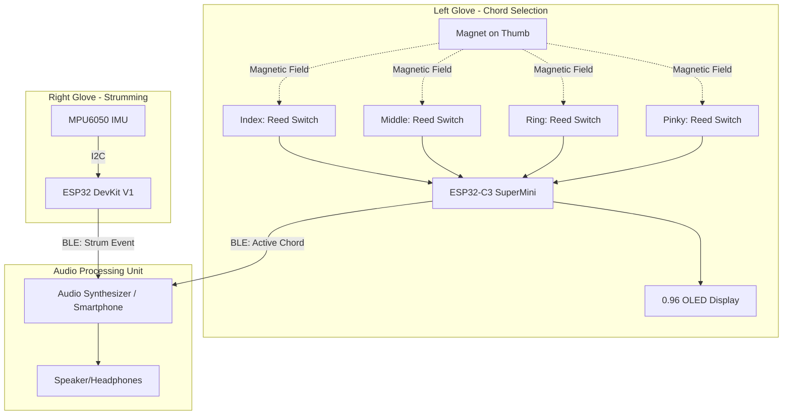
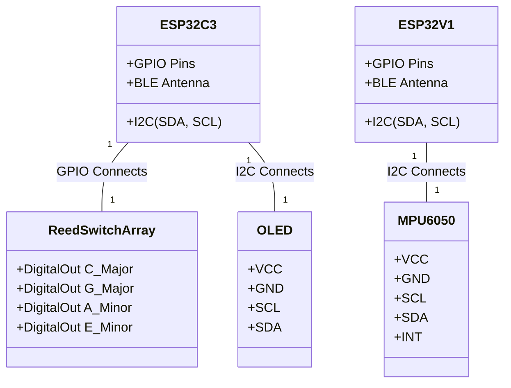
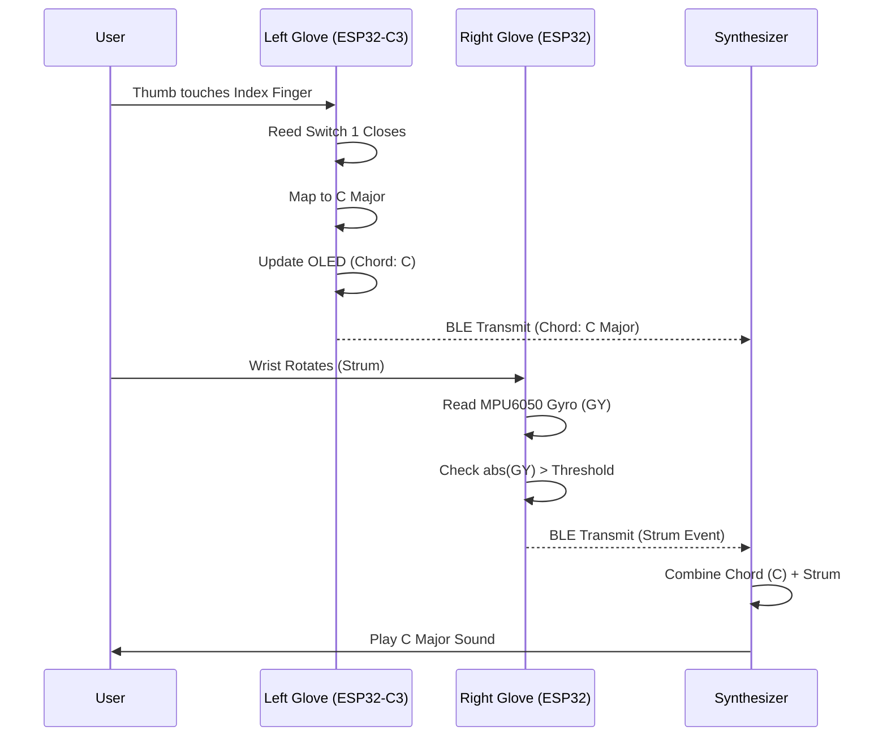

# System Diagrams

## 1. System Architecture Diagram

This diagram provides a high-level overview of the entire Air Guitar system, showcasing the two primary modules (Left and Right Gloves) and their communication protocol.

## 2. Component Diagram

Illustrates the physical hardware components and their wired connections within each subsystem.

## 3. Data Flow Diagram

Shows how data is generated, processed, and transformed into an action (sound).

